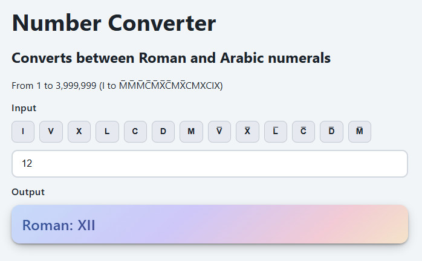

# RomeJS
Roman to Arabic Converter

* Rome.js supports Numbers from 1 to 3.999.999 (I to M̅M̅M̅C̅M̅X̅C̅MX̅CMXCIX)
* Rome.js supports rendering subtrees:
   * Specify the root element
   * Filter using css selector
* Rome.js observes attribute changes and new nodes (optional)
* Also comes with a ready to use index.html file


## Included web page


## API

1. Add span elements like this to your html:
   ```html
   <!-- below renders to XII -->
   <span data-arabic-number="12"></span>
   <!-- below renders to 12 -->
   <span data-roman-number="XII"></span>
   ```
1. Just include the script at the bottom of the body:
   ```html
   <!-- add this to the bottom of the html into the body -->
   <script src="rome.js"></script>
   <script>
   // uncomment below to set a special locale for arabic numbers
   //Rome.NUMBER_FORMAT_LOCALE = 'de-CH';
   Rome.renderElements();
   </script>
   ```

### Rome.RenderElements
Renders html elements that match a CSS selector in a given html tree (defaults to document).
```js
// defaults for renderElements
Rome.renderElements(
   // use a dedicated css selector
   querySelector = 'span[data-arabic-number], span[data-roman-number]',
  
   // defaults to document node, specify any HTMLElement node
   htmlNode = null,
  
   // observes attributes changes (and trigger a re-render)
   observeAttributes = true,
  
   // observes new elements being added (and trigger a render)
   // it will honor htmlNode and querySelector -> so just new elements that match will be rendered
   observeNewElements = true,

   // attributes name for the html elements:
   //    arabic number input (f.e. 12),
   //    roman number input (f.e. XII) and
   //    render output (auto, roman, arabic)
   customAttributes = {
        arabicName: 'data-arabic-number',
        romanName: 'data-roman-number',
        renderName: 'data-render-number'
   }
);
```

### Rome.attachToElement
Renders a single html element. Useful to integrate it within your frameworks.
```js
// defaults for attachToElement
Rome.attachToElement(
   // the HTMLElement (required)
   htmlNode,
  
   // observes attributes changes (and trigger a re-render)
   observeAttributes = true,

   // attributes name for the html elements:
   //    arabic number input (f.e. 12),
   //    roman number input (f.e. XII) and
   //    render output (auto, roman, arabic)
   customAttributes = {
        arabicName: 'data-arabic-number',
        romanName: 'data-roman-number',
        renderName: 'data-render-number'
   }
);
```
